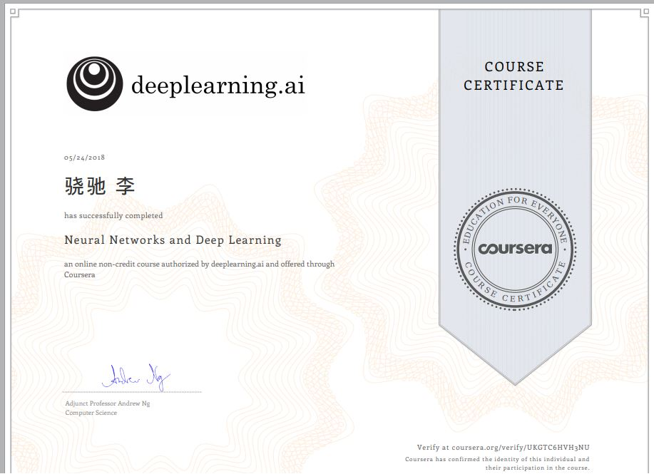

# Deep_Learning_Andrew_Ng
Assignments of Machine Learning course on coursera by Andrew Ng

## Part 1: Neural Networks and Deep Learning
Completed on May.23 2018
[Home page](https://www.coursera.org/learn/neural-networks-deep-learning/home/welcome)   

This is the beginning of Deep Learning,and I learnt the basic conceptions like gradient descent, forward propagation, backward propagation and vectorization in python.  Not very hard, very recommended!

